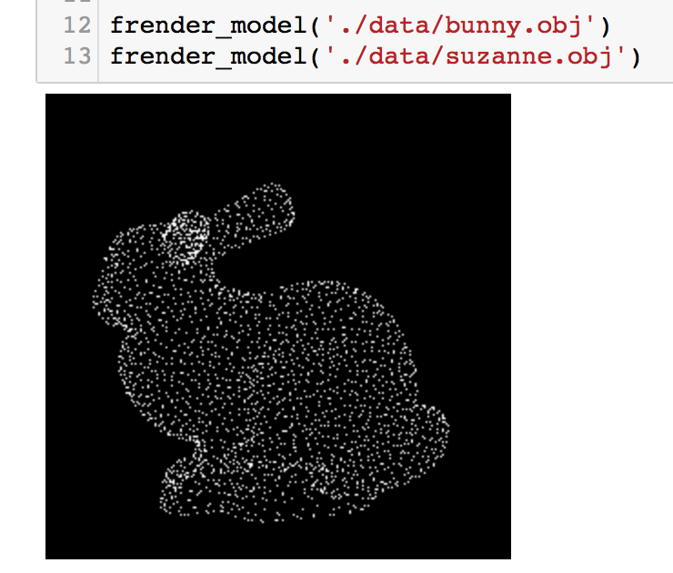

# jupyter_goodies
A collection of useful Jupyter Notebook goodies I wrote.

## pinhole.ipynb
This [notebook](pinhole.ipynb) uses a pinhole camera model to software-render models from .obj files. It processes the model vertices to center the model nicely in view. 

